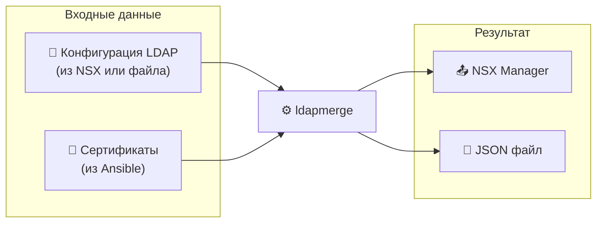

# ldapmerge


```
  ██╗     ██████╗  █████╗ ██████╗ ███╗   ███╗███████╗██████╗  ██████╗ ███████╗
  ██║     ██╔══██╗██╔══██╗██╔══██╗████╗ ████║██╔════╝██╔══██╗██╔════╝ ██╔════╝
  ██║     ██║  ██║███████║██████╔╝██╔████╔██║█████╗  ██████╔╝██║  ███╗█████╗
  ██║     ██║  ██║██╔══██║██╔═══╝ ██║╚██╔╝██║██╔══╝  ██╔══██╗██║   ██║██╔══╝
  ███████╗██████╔╝██║  ██║██║     ██║ ╚═╝ ██║███████╗██║  ██║╚██████╔╝███████╗
  ╚══════╝╚═════╝ ╚═╝  ╚═╝╚═╝     ╚═╝     ╚═╝╚══════╝╚═╝  ╚═╝ ╚═════╝ ╚══════╝
```

**LDAP Configuration Merger for VMware NSX 4.2**

Инструмент для объединения конфигураций LDAP серверов с SSL сертификатами и синхронизации с VMware NSX.

---

## Содержание

- [Возможности](#возможности)
- [Установка](#установка)
- [Быстрый старт](#быстрый-старт)
- [Использование](#использование)
- [API сервер](#api-сервер)
- [Документация](#документация)
- [Разработка](#разработка)
- [Лицензия](#лицензия)

---

## Возможности



| Функция | Описание |
|---------|----------|
| 🔄 **Sync** | Полный цикл: pull → merge → push |
| 📥 **Pull** | Получение конфигурации из NSX |
| 📤 **Push** | Загрузка конфигурации в NSX |
| 🔀 **Merge** | Объединение JSON файлов локально |
| 🩺 **Probe** | Тестирование LDAP подключений |
| 🔐 **Fetch Cert** | Получение SSL сертификатов |
| 🔎 **Search** | Поиск пользователей/групп |
| 🌐 **API Server** | REST API с документацией Scalar |

---

## Установка

### Из релизов

```bash
# Linux
curl -L https://github.com/dantte-lp/ldapmerge/releases/latest/download/ldapmerge-linux-amd64.tar.gz | tar xz
sudo mv ldapmerge-linux-amd64 /usr/local/bin/ldapmerge

# macOS (Apple Silicon)
curl -L https://github.com/dantte-lp/ldapmerge/releases/latest/download/ldapmerge-darwin-arm64.tar.gz | tar xz
sudo mv ldapmerge-darwin-arm64 /usr/local/bin/ldapmerge

# Windows (PowerShell)
Invoke-WebRequest -Uri https://github.com/dantte-lp/ldapmerge/releases/latest/download/ldapmerge-windows-amd64.zip -OutFile ldapmerge.zip
Expand-Archive ldapmerge.zip -DestinationPath .
```

### Docker

```bash
docker pull ghcr.io/dantte-lp/ldapmerge:latest

docker run --rm ghcr.io/dantte-lp/ldapmerge:latest version
```

### Из исходников

```bash
git clone https://github.com/dantte-lp/ldapmerge.git
cd ldapmerge
make build
```

---

## Быстрый старт

### Полная синхронизация с NSX

```bash
# Подготовьте файл с сертификатами (response.json из Ansible)
ldapmerge sync \
  --host https://nsx-manager.example.com \
  -u admin \
  -P 'your-password' \
  -k \
  -r response.json
```

### Локальное объединение файлов

```bash
ldapmerge merge \
  -i initial.json \
  -r response.json \
  -o result.json
```

### Запуск API сервера

```bash
ldapmerge server -p 8080

# Документация: http://localhost:8080/docs
```

---

## Использование

### Команды

| Команда | Описание |
|---------|----------|
| `sync` | Полный цикл синхронизации |
| `merge` | Объединение JSON файлов |
| `nsx pull` | Получить конфигурацию из NSX |
| `nsx push` | Загрузить конфигурацию в NSX |
| `nsx get` | Получить конкретный источник |
| `nsx delete` | Удалить источник |
| `nsx probe` | Тестировать LDAP подключение |
| `nsx fetch-cert` | Получить SSL сертификат |
| `nsx search` | Поиск пользователей/групп |
| `server` | Запустить API сервер |
| `version` | Показать версию |

### Примеры

```bash
# Получить все LDAP источники из NSX
ldapmerge nsx pull --host https://nsx.example.com -u admin -P pass -k

# Проверить LDAP подключение
ldapmerge nsx probe example.lab --host https://nsx.example.com -u admin -P pass -k

# Получить сертификат с LDAP сервера
ldapmerge nsx fetch-cert ldaps://ad-01.example.lab:636 --host https://nsx.example.com -u admin -P pass -k

# Поиск пользователя
ldapmerge nsx search example.lab --query "john" --type USER --host https://nsx.example.com -u admin -P pass -k
```

### Глобальные флаги

| Флаг | Описание |
|------|----------|
| `--config` | Путь к конфигурационному файлу |
| `--log-dir` | Директория для логов |
| `--log-level` | Уровень логирования: debug, info, warn, error |
| `--log-console` | Выводить логи в консоль |

---

## API сервер

```bash
ldapmerge server --port 8080 --db /var/lib/ldapmerge/data.db
```

### Endpoints

| Метод | Путь | Описание |
|-------|------|----------|
| `POST` | `/api/merge` | Объединить конфигурации |
| `GET` | `/api/history` | История операций |
| `GET` | `/api/history/{id}` | Конкретная запись |
| `GET` | `/api/configs` | Список NSX конфигов |
| `POST` | `/api/configs` | Создать конфиг |
| `DELETE` | `/api/configs/{id}` | Удалить конфиг |
| `GET` | `/api/health` | Проверка состояния |
| `GET` | `/docs` | Документация Scalar |

### Пример запроса

```bash
curl -X POST http://localhost:8080/api/merge \
  -H "Content-Type: application/json" \
  -d '{
    "initial": [...],
    "response": {...}
  }'
```

---

## Документация

| Документ | Описание |
|----------|----------|
| [QUICK_START.md](docs/QUICK_START.md) | Быстрый старт |
| [CLI.md](docs/CLI.md) | Документация CLI |
| [API.md](docs/API.md) | Документация REST API |
| [CHANGELOG.md](CHANGELOG.md) | История изменений |

---

## Разработка

### Требования

- Go 1.25+
- Make

### Сборка

```bash
# Собрать для текущей платформы
make build

# Собрать для всех платформ
make build-all

# Собрать с версией
make VERSION=1.0.0 build-all

# Запустить тесты
make test

# Создать релизные архивы
make release
```

### Структура проекта

```
ldapmerge/
├── cmd/ldapmerge/       # Точка входа
├── internal/
│   ├── api/             # REST API сервер
│   ├── cli/             # Cobra команды
│   ├── logging/         # Структурированные логи
│   ├── merger/          # Логика объединения
│   ├── models/          # Модели данных
│   ├── nsx/             # NSX API клиент
│   │   └── mock/        # Mock сервер для тестов
│   ├── repository/      # SQLite репозиторий
│   └── version/         # Информация о версии
├── docs/                # Документация
├── build/               # Скомпилированные бинари
├── Makefile             # Сборка и автоматизация
└── go.mod               # Go модуль
```

---

## Лицензия

MIT License. См. [LICENSE](LICENSE).

---

## Ссылки

- [VMware NSX 4.2 API](https://developer.broadcom.com/xapis/nsx-t-data-center-rest-api/4.2/)
- [Scalar API Documentation](https://scalar.com/)
- [Huma REST Framework](https://huma.rocks/)
