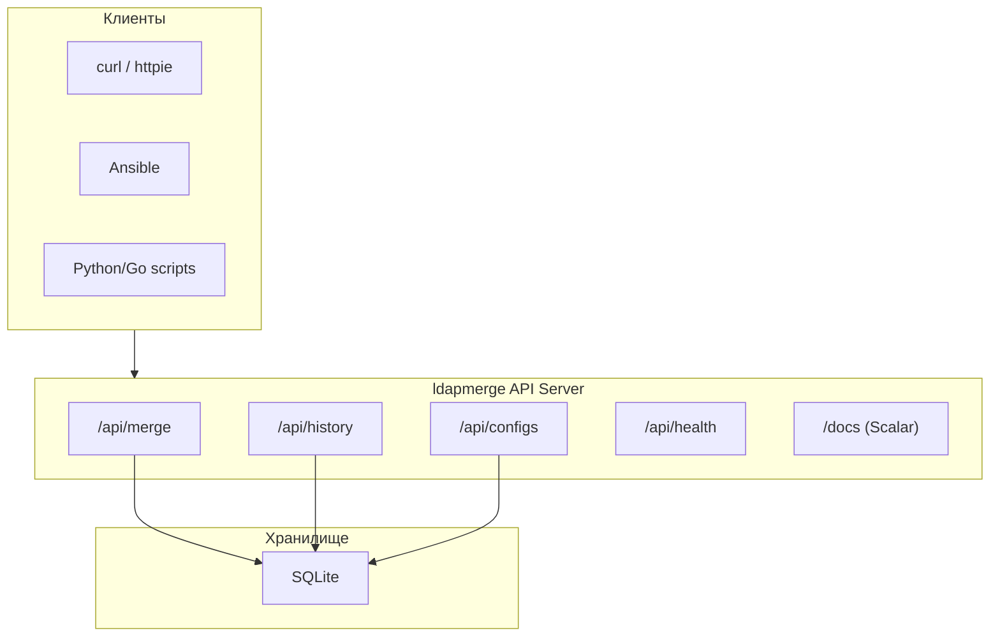
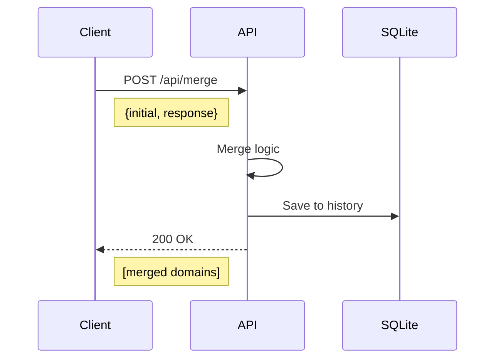

# API Документация


## Содержание

- [Обзор](#обзор)
- [Запуск сервера](#запуск-сервера)
- [Аутентификация](#аутентификация)
- [Endpoints](#endpoints)
  - [Merge](#merge)
  - [History](#history)
  - [Configs](#configs)
  - [Health](#health)
- [Модели данных](#модели-данных)
- [Примеры запросов](#примеры-запросов)
- [Коды ошибок](#коды-ошибок)

---

## Обзор

REST API для объединения LDAP конфигураций с сертификатами.



### Базовый URL

```
http://localhost:8080
```

### Интерактивная документация

После запуска сервера документация доступна по адресу:

```
http://localhost:8080/docs
```

---

## Запуск сервера

```bash
# Базовый запуск
ldapmerge server

# С параметрами
ldapmerge server \
  --port 8080 \
  --db /var/lib/ldapmerge/data.db \
  --log-console
```

**Вывод:**
```
Using database: /var/lib/ldapmerge/data.db
Starting API server on 0.0.0.0:8080
API documentation available at http://0.0.0.0:8080/docs
```

---

## Аутентификация

> ⚠️ **Внимание:** В текущей версии аутентификация не реализована. Рекомендуется использовать reverse proxy (nginx, traefik) для защиты API.

---

## Endpoints

### Merge

#### `POST /api/merge`

Объединяет initial конфигурацию с сертификатами из response.



##### Запрос

| Параметр | Тип | Описание |
|----------|-----|----------|
| `initial` | `Domain[]` | Массив доменов с LDAP серверами |
| `response` | `CertificateResponse` | Ответ с сертификатами |

##### Пример запроса

```bash
curl -X POST http://localhost:8080/api/merge \
  -H "Content-Type: application/json" \
  -d '{
    "initial": [
      {
        "id": "example.lab",
        "domain_name": "example.lab",
        "base_dn": "DC=example,DC=lab",
        "ldap_servers": [
          {
            "url": "ldaps://ad-01.example.lab:636",
            "enabled": "true",
            "bind_username": "admin@example.lab"
          }
        ]
      }
    ],
    "response": {
      "results": [
        {
          "json": {
            "pem_encoded": "-----BEGIN CERTIFICATE-----\n...\n-----END CERTIFICATE-----"
          },
          "item": {
            "url": "ldaps://ad-01.example.lab:636"
          }
        }
      ]
    }
  }'
```

##### Ответ

```json
[
  {
    "id": "example.lab",
    "domain_name": "example.lab",
    "base_dn": "DC=example,DC=lab",
    "ldap_servers": [
      {
        "url": "ldaps://ad-01.example.lab:636",
        "enabled": "true",
        "bind_username": "admin@example.lab",
        "certificates": [
          "-----BEGIN CERTIFICATE-----\n...\n-----END CERTIFICATE-----"
        ]
      }
    ]
  }
]
```

---

### History

#### `GET /api/history`

Получить список всех операций merge.

##### Пример запроса

```bash
curl http://localhost:8080/api/history
```

##### Ответ

```json
[
  {
    "id": 1,
    "created_at": "2025-01-15T10:30:00Z",
    "initial": [...],
    "response": {...},
    "result": [...]
  },
  {
    "id": 2,
    "created_at": "2025-01-15T11:00:00Z",
    "initial": [...],
    "response": {...},
    "result": [...]
  }
]
```

---

#### `GET /api/history/{id}`

Получить конкретную запись истории.

##### Параметры пути

| Параметр | Тип | Описание |
|----------|-----|----------|
| `id` | `integer` | ID записи истории |

##### Пример запроса

```bash
curl http://localhost:8080/api/history/1
```

##### Ответ

```json
{
  "id": 1,
  "created_at": "2025-01-15T10:30:00Z",
  "initial": [
    {
      "id": "example.lab",
      "domain_name": "example.lab",
      "ldap_servers": [...]
    }
  ],
  "response": {
    "results": [...]
  },
  "result": [
    {
      "id": "example.lab",
      "domain_name": "example.lab",
      "ldap_servers": [...]
    }
  ]
}
```

---

### Configs

#### `GET /api/configs`

Получить список сохранённых NSX конфигураций.

##### Пример запроса

```bash
curl http://localhost:8080/api/configs
```

##### Ответ

```json
[
  {
    "id": 1,
    "name": "production-nsx",
    "description": "Production NSX Manager",
    "host": "https://nsx.example.com",
    "username": "admin",
    "insecure": false,
    "created_at": "2025-01-15T10:00:00Z",
    "updated_at": "2025-01-15T10:00:00Z"
  }
]
```

---

#### `POST /api/configs`

Создать новую NSX конфигурацию.

##### Запрос

| Параметр | Тип | Описание | Обязательный |
|----------|-----|----------|--------------|
| `name` | `string` | Имя конфигурации | ✅ |
| `description` | `string` | Описание | ❌ |
| `host` | `string` | URL NSX Manager | ✅ |
| `username` | `string` | Имя пользователя | ✅ |
| `password` | `string` | Пароль | ❌ |
| `insecure` | `boolean` | Пропустить TLS | ❌ |

##### Пример запроса

```bash
curl -X POST http://localhost:8080/api/configs \
  -H "Content-Type: application/json" \
  -d '{
    "name": "production-nsx",
    "description": "Production NSX Manager",
    "host": "https://nsx.example.com",
    "username": "admin",
    "password": "secret",
    "insecure": false
  }'
```

##### Ответ

```json
{
  "id": 1,
  "name": "production-nsx",
  "description": "Production NSX Manager",
  "host": "https://nsx.example.com",
  "username": "admin",
  "insecure": false,
  "created_at": "2025-01-15T10:00:00Z",
  "updated_at": "2025-01-15T10:00:00Z"
}
```

---

#### `GET /api/configs/{id}`

Получить конкретную NSX конфигурацию.

##### Пример запроса

```bash
curl http://localhost:8080/api/configs/1
```

---

#### `DELETE /api/configs/{id}`

Удалить NSX конфигурацию.

##### Пример запроса

```bash
curl -X DELETE http://localhost:8080/api/configs/1
```

##### Ответ

```
HTTP/1.1 204 No Content
```

---

### Health

#### `GET /api/health`

Проверка состояния сервера.

##### Пример запроса

```bash
curl http://localhost:8080/api/health
```

##### Ответ

```json
{
  "status": "ok",
  "version": "1.0.0"
}
```

---

## Модели данных

### Domain

```typescript
interface Domain {
  id: string;                          // Уникальный идентификатор
  domain_name: string;                 // Имя домена
  base_dn: string;                     // Base DN для LDAP
  alternative_domain_names?: string[]; // Альтернативные имена
  ldap_servers: LDAPServer[];          // Список LDAP серверов
}
```

### LDAPServer

```typescript
interface LDAPServer {
  url: string;                    // URL сервера (ldaps://host:636)
  starttls?: string;              // Использовать StartTLS
  enabled?: string;               // Включен
  bind_username?: string;         // Имя пользователя для bind
  bind_password?: string;         // Пароль
  certificates?: string[];        // PEM сертификаты
}
```

### CertificateResponse

```typescript
interface CertificateResponse {
  results: CertificateResult[];
}

interface CertificateResult {
  json: {
    pem_encoded: string;          // PEM сертификат
    details?: CertificateDetail[];
  };
  item: {
    url: string;                  // URL LDAP сервера
  };
}
```

### HistoryEntry

```typescript
interface HistoryEntry {
  id: number;
  created_at: string;             // ISO 8601
  initial: Domain[];
  response: CertificateResponse;
  result: Domain[];
}
```

### NSXConfig

```typescript
interface NSXConfig {
  id?: number;
  name: string;
  description?: string;
  host: string;
  username: string;
  password?: string;              // Только для записи
  insecure: boolean;
  created_at?: string;
  updated_at?: string;
}
```

---

## Примеры запросов

### Python

```python
import requests

BASE_URL = "http://localhost:8080"

# Merge
response = requests.post(f"{BASE_URL}/api/merge", json={
    "initial": [...],
    "response": {...}
})
result = response.json()

# History
history = requests.get(f"{BASE_URL}/api/history").json()

# Create config
config = requests.post(f"{BASE_URL}/api/configs", json={
    "name": "prod-nsx",
    "host": "https://nsx.example.com",
    "username": "admin",
    "password": "secret"
}).json()
```

### Go

```go
package main

import (
    "bytes"
    "encoding/json"
    "net/http"
)

func main() {
    body := map[string]interface{}{
        "initial":  []interface{}{...},
        "response": map[string]interface{}{...},
    }

    jsonBody, _ := json.Marshal(body)

    resp, _ := http.Post(
        "http://localhost:8080/api/merge",
        "application/json",
        bytes.NewReader(jsonBody),
    )
    defer resp.Body.Close()

    var result []map[string]interface{}
    json.NewDecoder(resp.Body).Decode(&result)
}
```

### Ansible

```yaml
- name: Merge LDAP configs via API
  uri:
    url: "http://localhost:8080/api/merge"
    method: POST
    body_format: json
    body:
      initial: "{{ ldap_initial }}"
      response: "{{ certificate_response }}"
    return_content: yes
  register: merge_result

- name: Show merged result
  debug:
    var: merge_result.json
```

---

## Коды ошибок

| HTTP код | Описание |
|----------|----------|
| `200` | Успешный запрос |
| `201` | Ресурс создан |
| `204` | Успешно, без содержимого |
| `400` | Неверный запрос |
| `404` | Ресурс не найден |
| `500` | Внутренняя ошибка сервера |

### Формат ошибки

```json
{
  "$schema": "...",
  "title": "Bad Request",
  "status": 400,
  "detail": "Invalid JSON body"
}
```

---

## OpenAPI Schema

Полная OpenAPI 3.0 схема доступна по адресу:

```
http://localhost:8080/openapi.json
```

---

## См. также

- [CLI.md](CLI.md) — Документация CLI
- [QUICK_START.md](QUICK_START.md) — Быстрый старт
- [Scalar](https://scalar.com/) — Документация API
