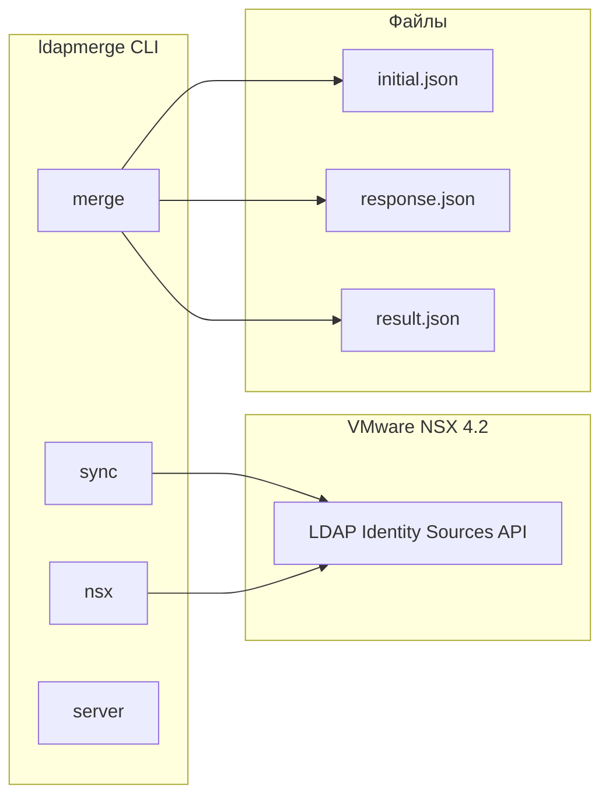
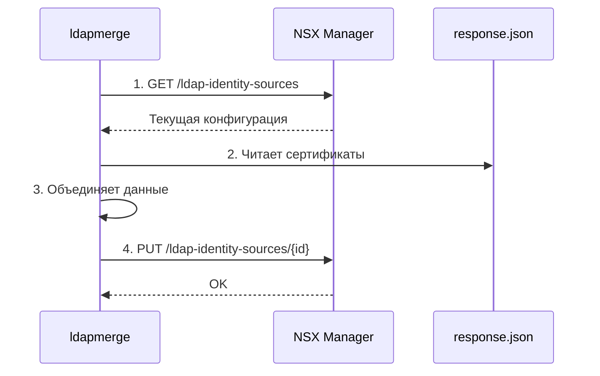

# CLI Документация


## Содержание

- [Обзор](#обзор)
- [Установка](#установка)
- [Глобальные флаги](#глобальные-флаги)
- [Команды](#команды)
  - [sync](#sync---полный-цикл-синхронизации)
  - [merge](#merge---объединение-файлов)
  - [nsx](#nsx---операции-с-nsx-api)
  - [server](#server---запуск-api-сервера)
- [Примеры использования](#примеры-использования)
- [Конфигурация](#конфигурация)
- [Логирование](#логирование)

---

## Обзор

**ldapmerge** — инструмент командной строки для управления LDAP Identity Sources в VMware NSX 4.2.



---

## Установка

```bash
# Сборка из исходников
go build -o ldapmerge ./cmd/ldapmerge

# Установка в PATH
sudo mv ldapmerge /usr/local/bin/

# Проверка
ldapmerge --version
```

### Кросс-компиляция

| Платформа | Команда |
|-----------|---------|
| Linux amd64 | `GOOS=linux GOARCH=amd64 go build -o ldapmerge-linux ./cmd/ldapmerge` |
| Windows amd64 | `GOOS=windows GOARCH=amd64 go build -o ldapmerge.exe ./cmd/ldapmerge` |
| macOS arm64 | `GOOS=darwin GOARCH=arm64 go build -o ldapmerge-darwin ./cmd/ldapmerge` |

---

## Глобальные флаги

| Флаг | Описание | По умолчанию |
|------|----------|--------------|
| `--config` | Путь к файлу конфигурации | `$HOME/.ldapmerge.yaml` |
| `--log-dir` | Директория для логов | Директория исполняемого файла |
| `--log-level` | Уровень логирования: `debug`, `info`, `warn`, `error` | `info` |
| `--log-console` | Дублировать логи в консоль | `false` |

---

## Команды

### `sync` — Полный цикл синхронизации

Выполняет полный цикл: **PULL → MERGE → PUSH** одной командой.



#### Синтаксис

```bash
ldapmerge sync [флаги]
```

#### Флаги

| Флаг | Сокращение | Описание | Обязательный |
|------|------------|----------|--------------|
| `--host` | | URL NSX Manager | ✅ |
| `--username` | `-u` | Имя пользователя NSX | ✅ |
| `--password` | `-P` | Пароль NSX | ✅ |
| `--response` | `-r` | Путь к файлу с сертификатами | ✅ |
| `--output` | `-o` | Сохранить результат в файл | ❌ |
| `--insecure` | `-k` | Пропустить проверку TLS | ❌ |
| `--dry-run` | | Только pull + merge, без push | ❌ |
| `--timeout` | | Таймаут запроса (сек) | ❌ (30) |

#### Примеры

```bash
# Базовое использование
ldapmerge sync \
  --host https://nsx.example.com \
  -u admin -P 'password' \
  -r certificates.json

# Dry-run (без изменений в NSX)
ldapmerge sync \
  --host https://nsx.example.com \
  -u admin -P 'password' \
  -r certificates.json \
  --dry-run

# С сохранением результата
ldapmerge sync \
  --host https://nsx.example.com \
  -u admin -P 'password' -k \
  -r certificates.json \
  -o merged_result.json
```

#### Вывод

```
► Step 1/3: Pulling current configuration from NSX...
  ✓ Fetched 2 LDAP identity sources
► Step 2/3: Merging with certificate data...
  ✓ Merged 2 domains, 4 certificates added
► Step 3/3: Pushing configuration to NSX...
  ✓ example.lab
  ✓ example.org

✓ Sync completed successfully
```

---

### `merge` — Объединение файлов

Объединяет initial JSON с сертификатами из response JSON локально, без подключения к NSX.

#### Синтаксис

```bash
ldapmerge merge [флаги]
```

#### Флаги

| Флаг | Сокращение | Описание | Обязательный |
|------|------------|----------|--------------|
| `--initial` | `-i` | Путь к initial JSON | ✅ |
| `--response` | `-r` | Путь к response JSON | ✅ |
| `--output` | `-o` | Путь к выходному файлу | ❌ (stdout) |
| `--compact` | `-c` | Компактный JSON | ❌ |

#### Примеры

```bash
# Вывод в stdout
ldapmerge merge -i initial.json -r response.json

# Сохранение в файл
ldapmerge merge -i initial.json -r response.json -o result.json

# Компактный JSON
ldapmerge merge -i initial.json -r response.json -c
```

---

### `nsx` — Операции с NSX API

Группа команд для работы с NSX LDAP Identity Sources API.

#### Общие флаги NSX

| Флаг | Сокращение | Описание |
|------|------------|----------|
| `--host` | | URL NSX Manager |
| `--username` | `-u` | Имя пользователя |
| `--password` | `-P` | Пароль |
| `--insecure` | `-k` | Пропустить проверку TLS |
| `--timeout` | | Таймаут (сек) |

#### Подкоманды

##### `nsx pull` — Получить все источники

```bash
ldapmerge nsx pull --host https://nsx.example.com -u admin -P secret -k
```

##### `nsx get <id>` — Получить конкретный источник

```bash
ldapmerge nsx get example.lab --host https://nsx.example.com -u admin -P secret -k
```

##### `nsx push -f <file>` — Загрузить конфигурацию

```bash
ldapmerge nsx push -f result.json --host https://nsx.example.com -u admin -P secret -k
```

##### `nsx delete <id>` — Удалить источник

```bash
ldapmerge nsx delete old.domain --host https://nsx.example.com -u admin -P secret -k
```

##### `nsx probe <id>` — Проверить подключение

```bash
ldapmerge nsx probe example.lab --host https://nsx.example.com -u admin -P secret -k
```

**Вывод:**
```
Probe results for example.lab:
  ✓ ldaps://ad-01.example.lab:636
  ✓ ldaps://ad-02.example.lab:636
```

##### `nsx fetch-cert <ldap-url>` — Получить сертификат

```bash
ldapmerge nsx fetch-cert ldaps://ad-01.example.lab:636 \
  --host https://nsx.example.com -u admin -P secret -k
```

**Вывод:**
```
Certificate from ldaps://ad-01.example.lab:636:

  Subject CN:  ad-01.example.lab
  Subject DN:  CN=ad-01.example.lab
  Issuer CN:   Example CA
  Not Before:  2024-01-01T00:00:00Z
  Not After:   2025-12-31T23:59:59Z
  Algorithm:   SHA256-RSA

PEM Certificate:
-----BEGIN CERTIFICATE-----
MIIDxTCCAq2gAwIBAgIQAqxcJmoLQJuPC3nyrkYldzANBgkqhkiG9w...
-----END CERTIFICATE-----
```

##### `nsx search <id> <filter>` — Поиск пользователей/групп

```bash
ldapmerge nsx search example.lab "john" \
  --host https://nsx.example.com -u admin -P secret -k
```

**Вывод:**
```
Search results for 'john' in example.lab (3 found):

👤 john.doe
   DN: CN=john.doe,OU=Users,DC=example,DC=lab
   Display Name: John Doe
   Email: john.doe@example.lab

👤 john.smith
   DN: CN=john.smith,OU=Users,DC=example,DC=lab
   Display Name: John Smith

👥 john-team
   DN: CN=john-team,OU=Groups,DC=example,DC=lab
   Display Name: John's Team
```

---

### `server` — Запуск API сервера

Запускает HTTP сервер с REST API.

#### Синтаксис

```bash
ldapmerge server [флаги]
```

#### Флаги

| Флаг | Сокращение | Описание | По умолчанию |
|------|------------|----------|--------------|
| `--host` | | Адрес сервера | `0.0.0.0` |
| `--port` | `-p` | Порт | `8080` |
| `--db` | | Путь к SQLite БД | `$HOME/.ldapmerge/data.db` |

#### Примеры

```bash
# Запуск на порту 8080
ldapmerge server

# Запуск на другом порту
ldapmerge server -p 3000

# С указанием БД
ldapmerge server --db /var/lib/ldapmerge/data.db
```

---

## Примеры использования

### Сценарий 1: Полная синхронизация

```bash
# 1. Ansible получает сертификаты и сохраняет в response.json
# 2. Запуск полного цикла
ldapmerge sync \
  --host https://nsx.example.com \
  -u admin -P "$NSX_PASSWORD" -k \
  -r /tmp/ansible_certificates.json \
  -o /tmp/merged_result.json \
  --log-console
```

### Сценарий 2: Поэтапная работа

```bash
# 1. Получить текущую конфигурацию
ldapmerge nsx pull \
  --host https://nsx.example.com \
  -u admin -P secret -k > initial.json

# 2. Объединить с сертификатами
ldapmerge merge -i initial.json -r response.json -o result.json

# 3. Загрузить обратно
ldapmerge nsx push -f result.json \
  --host https://nsx.example.com \
  -u admin -P secret -k
```

### Сценарий 3: Диагностика

```bash
# Проверить подключение к LDAP серверам
ldapmerge nsx probe example.lab \
  --host https://nsx.example.com \
  -u admin -P secret -k

# Получить сертификат для диагностики
ldapmerge nsx fetch-cert ldaps://dc01.example.lab:636 \
  --host https://nsx.example.com \
  -u admin -P secret -k
```

---

## Конфигурация

### Файл конфигурации

Создайте `~/.ldapmerge.yaml`:

```yaml
# NSX настройки (опционально)
nsx:
  host: https://nsx.example.com
  username: admin
  insecure: true

# Логирование
logging:
  dir: /var/log/ldapmerge
  level: info
  console: false

# API сервер
server:
  host: 0.0.0.0
  port: 8080
  db: /var/lib/ldapmerge/data.db
```

### Переменные окружения

| Переменная | Описание |
|------------|----------|
| `LDAPMERGE_NSX_HOST` | URL NSX Manager |
| `LDAPMERGE_NSX_USERNAME` | Имя пользователя |
| `LDAPMERGE_NSX_PASSWORD` | Пароль |
| `LDAPMERGE_LOG_LEVEL` | Уровень логирования |

---

## Логирование

### Формат логов (JSON)

```json
{
  "time": "2025-01-15T10:30:00Z",
  "level": "INFO",
  "msg": "sync operation started",
  "command": "sync",
  "nsx_host": "https://nsx.example.com",
  "dry_run": false
}
```

### Ротация логов

| Параметр | Значение |
|----------|----------|
| Максимальный размер | 100 MB |
| Количество файлов | 5 |
| Срок хранения | 30 дней |
| Сжатие | Включено (gzip) |

### Включение консольного вывода

```bash
ldapmerge sync ... --log-console --log-level debug
```

---

## Коды возврата

| Код | Описание |
|-----|----------|
| `0` | Успешное выполнение |
| `1` | Общая ошибка |
| `2` | Ошибка аутентификации |
| `3` | Ошибка подключения к NSX |
| `4` | Ошибка чтения/записи файла |

---

## См. также

- [API.md](API.md) — Документация REST API
- [QUICK_START.md](QUICK_START.md) — Быстрый старт
- [NSX 4.2 API Reference](https://developer.broadcom.com/xapis/nsx-t-data-center-rest-api/4.2/)
