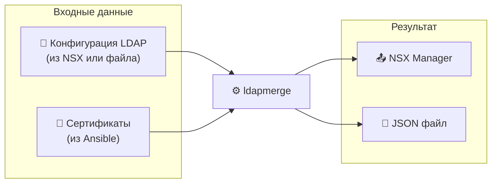

# Быстрый старт


## Содержание

- [Что делает ldapmerge?](#что-делает-ldapmerge)
- [Установка](#установка)
- [Сценарий 1: Синхронизация с NSX](#сценарий-1-синхронизация-с-nsx)
- [Сценарий 2: Локальное объединение файлов](#сценарий-2-локальное-объединение-файлов)
- [Сценарий 3: API сервер](#сценарий-3-api-сервер)
- [Интеграция с Ansible](#интеграция-с-ansible)
- [Диагностика проблем](#диагностика-проблем)

---

## Что делает ldapmerge?

**ldapmerge** объединяет конфигурации LDAP серверов с SSL сертификатами и загружает результат в VMware NSX.



### Проблема

NSX требует SSL сертификаты для LDAP серверов, но их нужно получать отдельно (например, через Ansible).

### Решение

**ldapmerge** автоматически:
1. ✅ Получает текущую конфигурацию из NSX
2. ✅ Объединяет с сертификатами по URL сервера
3. ✅ Загружает обновлённую конфигурацию обратно

---

## Установка

```bash
# Клонировать репозиторий
git clone https://github.com/example/ldapmerge.git
cd ldapmerge

# Собрать
go build -o ldapmerge ./cmd/ldapmerge

# Проверить
./ldapmerge --help
```

---

## Сценарий 1: Синхронизация с NSX

> 🎯 **Цель:** Обновить LDAP конфигурацию в NSX с новыми сертификатами

### Шаг 1: Подготовьте файл с сертификатами

Ansible playbook создаёт `response.json`:

```json
{
  "results": [
    {
      "json": {
        "pem_encoded": "-----BEGIN CERTIFICATE-----\nMIIC...\n-----END CERTIFICATE-----"
      },
      "item": {
        "url": "ldaps://ad-01.example.lab:636"
      }
    }
  ]
}
```

### Шаг 2: Запустите синхронизацию

```bash
./ldapmerge sync \
  --host https://nsx-manager.example.com \
  -u admin \
  -P 'your-password' \
  -k \
  -r response.json
```

### Результат

```
► Step 1/3: Pulling current configuration from NSX...
  ✓ Fetched 2 LDAP identity sources
► Step 2/3: Merging with certificate data...
  ✓ Merged 2 domains, 4 certificates added
► Step 3/3: Pushing configuration to NSX...
  ✓ example.lab
  ✓ example.org

✓ Sync completed successfully
```

### Опции

| Опция | Описание |
|-------|----------|
| `--dry-run` | Только показать что будет сделано |
| `-o result.json` | Сохранить результат в файл |
| `--log-console` | Показать логи в консоли |

---

## Сценарий 2: Локальное объединение файлов

> 🎯 **Цель:** Объединить JSON файлы без подключения к NSX

### Шаг 1: Подготовьте initial.json

```json
[
  {
    "id": "example.lab",
    "domain_name": "example.lab",
    "base_dn": "DC=example,DC=lab",
    "ldap_servers": [
      {
        "url": "ldaps://ad-01.example.lab:636",
        "enabled": "true",
        "bind_username": "sync@example.lab",
        "bind_password": "secret"
      }
    ]
  }
]
```

### Шаг 2: Запустите merge

```bash
./ldapmerge merge \
  -i initial.json \
  -r response.json \
  -o result.json
```

### Результат (result.json)

```json
[
  {
    "id": "example.lab",
    "domain_name": "example.lab",
    "base_dn": "DC=example,DC=lab",
    "ldap_servers": [
      {
        "url": "ldaps://ad-01.example.lab:636",
        "enabled": "true",
        "bind_username": "sync@example.lab",
        "bind_password": "secret",
        "certificates": [
          "-----BEGIN CERTIFICATE-----\nMIIC...\n-----END CERTIFICATE-----"
        ]
      }
    ]
  }
]
```

---

## Сценарий 3: API сервер

> 🎯 **Цель:** Запустить REST API для интеграции с другими системами

### Шаг 1: Запустите сервер

```bash
./ldapmerge server --port 8080
```

### Шаг 2: Используйте API

```bash
# Merge через API
curl -X POST http://localhost:8080/api/merge \
  -H "Content-Type: application/json" \
  -d @request.json

# Проверка здоровья
curl http://localhost:8080/api/health

# История операций
curl http://localhost:8080/api/history
```

### Шаг 3: Откройте документацию

```
http://localhost:8080/docs
```

---

## Интеграция с Ansible

### Полный playbook

```yaml
---
- name: Sync LDAP certificates to NSX
  hosts: localhost
  vars:
    nsx_host: "https://nsx-manager.example.com"
    nsx_user: "admin"
    nsx_pass: "{{ vault_nsx_password }}"
    ldap_servers:
      - url: "ldaps://ad-01.example.lab:636"
      - url: "ldaps://ad-02.example.lab:636"

  tasks:
    # 1. Получить сертификаты с LDAP серверов
    - name: Fetch certificates from LDAP servers
      uri:
        url: "https://cert-fetcher.example.com/api/fetch"
        method: POST
        body_format: json
        body:
          servers: "{{ ldap_servers }}"
        return_content: yes
      register: cert_response

    # 2. Сохранить ответ в файл
    - name: Save certificate response
      copy:
        content: "{{ cert_response.json | to_nice_json }}"
        dest: /tmp/certificates.json

    # 3. Запустить синхронизацию
    - name: Sync to NSX
      command: >
        /usr/local/bin/ldapmerge sync
        --host {{ nsx_host }}
        -u {{ nsx_user }}
        -P {{ nsx_pass }}
        -k
        -r /tmp/certificates.json
      register: sync_result

    # 4. Показать результат
    - name: Show sync result
      debug:
        var: sync_result.stdout_lines
```

### Cron задача

```bash
# /etc/cron.d/ldapmerge-sync
0 2 * * * root /usr/local/bin/ldapmerge sync \
  --host https://nsx.example.com \
  -u admin -P 'password' -k \
  -r /var/lib/ansible/certificates.json \
  --log-dir /var/log/ldapmerge \
  >> /var/log/ldapmerge/cron.log 2>&1
```

---

## Диагностика проблем

### Проблема: Ошибка подключения к NSX

```bash
# Проверить подключение
./ldapmerge nsx pull \
  --host https://nsx.example.com \
  -u admin -P 'password' -k

# Включить подробные логи
./ldapmerge sync ... --log-console --log-level debug
```

### Проблема: Сертификат не добавляется

Проверьте, что URL в response.json **точно совпадает** с URL в initial:

```bash
# Правильно
"url": "ldaps://ad-01.example.lab:636"

# Неправильно (другой порт)
"url": "ldaps://ad-01.example.lab:389"

# Неправильно (другой протокол)
"url": "ldap://ad-01.example.lab:636"
```

### Проблема: Проверка LDAP серверов

```bash
# Проверить подключение к LDAP серверам
./ldapmerge nsx probe example.lab \
  --host https://nsx.example.com \
  -u admin -P 'password' -k

# Получить сертификат напрямую
./ldapmerge nsx fetch-cert ldaps://ad-01.example.lab:636 \
  --host https://nsx.example.com \
  -u admin -P 'password' -k
```

### Просмотр логов

```bash
# Логи по умолчанию
cat ./ldapmerge.log

# JSON формат - удобно с jq
cat ./ldapmerge.log | jq '.'

# Фильтрация ошибок
cat ./ldapmerge.log | jq 'select(.level == "ERROR")'
```

---

## Шпаргалка команд

| Задача | Команда |
|--------|---------|
| Полная синхронизация | `ldapmerge sync --host URL -u USER -P PASS -r certs.json` |
| Только merge | `ldapmerge merge -i initial.json -r response.json` |
| Получить из NSX | `ldapmerge nsx pull --host URL -u USER -P PASS` |
| Загрузить в NSX | `ldapmerge nsx push -f result.json --host URL -u USER -P PASS` |
| Проверить LDAP | `ldapmerge nsx probe domain.lab --host URL -u USER -P PASS` |
| Получить сертификат | `ldapmerge nsx fetch-cert ldaps://server:636 --host URL -u USER -P PASS` |
| Запустить сервер | `ldapmerge server -p 8080` |

---

## Следующие шаги

1. 📖 Прочитайте [CLI.md](CLI.md) для полного списка команд
2. 📖 Прочитайте [API.md](API.md) для интеграции через REST API
3. 🔧 Настройте конфиг в `~/.ldapmerge.yaml`
4. 🚀 Интегрируйте с Ansible/CI-CD

---

## Поддержка

- 📝 [GitHub Issues](https://github.com/example/ldapmerge/issues)
- 📚 [NSX 4.2 API Docs](https://developer.broadcom.com/xapis/nsx-t-data-center-rest-api/4.2/)
